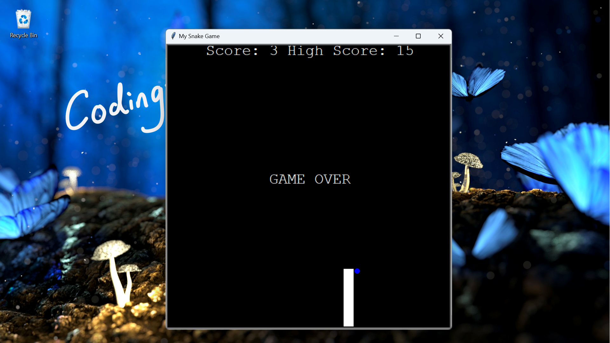
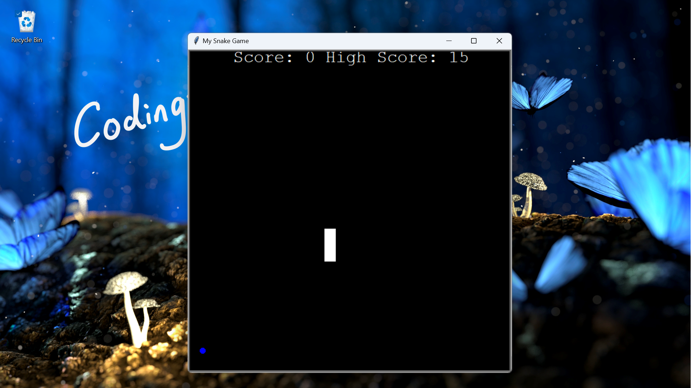

# Snake Game

This is a simple Snake game implemented in Python. The game allows the player to control a snake, 
and eat food to gain points. The game is over when the snake runs into a wall or into itself.

 

# Getting Started

To get started with this Snake game, you will need to have the following prerequisites installed:

- `Python 3.x`

Once you have Python installed, you can run the game by following these steps:

1. Download the game files. You can do this by cloning this repository or downloading the zip file.

2. Extract the game files. You can do this by using your operating system's file explorer to extract the 
downloaded file, or by using a tool like 7-Zip or WinZip.

3. Open the game in PyCharm or Visual Studio Code. You can do this by launching PyCharm or Visual Studio Code,
and then opening the extracted game directory.

4. Run the game. You can do this by using the "Run" or "Start Debugging" command in PyCharm or Visual Studio Code.

   Alternatively, you can open a terminal in the game directory, and then run the python main.py command.

5. Play the game. Use the arrow keys to control the snake, and eat the food to gain points. 
The game is over when the snake runs into a wall or into itself.

To restart the game, Run the file again.

To exit the game, press the end-button.

## Data
The game uses the following data sources:

- High scores: `data.txt` , These data sources are loaded when the game starts, and are used to keep track of the player's high score.
- Always run the `main.py` file, to play the game.
- `food.py` generates random food on the screen
- `scoreboard.py` file keeps track of the scoreboard.
- `snake.py` file is for handling the body of the snake.

## Technologies
This game was built using the following technologies:

- Python: A popular programming language for web and desktop applications.
- Terminal or Command Prompt: A text-based interface for interacting with the operating system.

## Contributing
If you would like to contribute to this game, please fork the repository and submit a pull request.

## License
This game is licensed under the MIT License.
